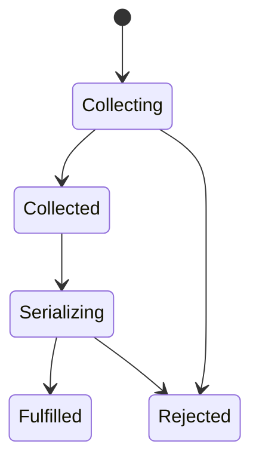

# Module: glTF Exporter

> Package path: `packages/babylon-lite/src/export-gltf/`

## Purpose

Export the current contents of a Babylon Lite `SceneContext` as one portable
glTF 2.0 GLB. V1 is a small, static geometry exporter:

- The scene graph contains every mesh in `scene.meshes` and the `SceneNode`
  ancestors needed to place it.
- The output preserves the selected hierarchy, names, current transforms, mesh
  wrappers, retained CPU positions, normals, indices, and optional `TEXCOORD_0`.
- The output contains no materials, textures, cameras, lights, animation,
  deformation baking, metadata, extensions, or external files.
- The exporter reads the current scene state; it does not promise a
  source-preserving round trip.
- It performs no GPU readback, general graph repair, or full runtime validation
  of mesh data.

The exporter has two private phases:

```text
exportSceneGLB(scene)
  -> collectSceneForGltf(scene)       // synchronous graph and data collection
  -> serializeGlb(collected)          // asynchronous CPU conversion and packing
  -> Blob("model/gltf-binary")
```

This document is the complete v1 contract for the exporter. Babylon.js is the
behavioral reference for handedness, conversion root removal, winding, and
related exporter details; its source and tests are not copied.

glTF names follow the
[glTF 2.0 concepts](https://registry.khronos.org/glTF/specs/2.0/glTF-2.0.html#concepts):
scene, node, mesh, primitive, attribute, accessor, buffer view, buffer, JSON
chunk, and BIN chunk.

For this document:

| Term          | Meaning                                                                                                                  |
| ------------- | ------------------------------------------------------------------------------------------------------------------------ |
| Selected node | A mesh in `scene.meshes` or one of its `SceneNode` ancestors, stopping before a non-`SceneNode` world matrix provider.   |
| Base geometry | Retained CPU positions, normals, indices, and optional UV0 before skeleton, morph, VAT, or thin-instance evaluation.     |
| V1 output     | The glTF structures this exporter writes. The test helper checks only these structures; it is not a full glTF validator. |
| Coded error   | Lite's existing thrown-error convention, including its current message and decoding behavior.                            |

## Public API Surface

```ts
export function exportSceneGLB(scene: SceneContext): Promise<Blob>;
```

- This is the only public function. It is a standalone named export from
  `packages/babylon-lite/src/index.ts`, and the package keeps one root entry
  point. No exporter type or method is public, and no package subpath export is
  added.
- The function accepts exactly one `SceneContext`. There is no options object,
  overload, alternate container, node-array input, engine parameter, device
  parameter, raw WebGPU handle, or experimental or preview label.
- The fulfilled value is a `Blob` whose MIME type is exactly
  `model/gltf-binary`.
- The package function does not create an object URL, download a file, touch
  the DOM, or expose download behavior. Downloading belongs to the lab demo.
- It performs no runtime nominal or shape check of `SceneContext`, does not
  inspect `_kind` or `_disposed`, does not require registration or rendering,
  and does not require an engine or device.
- Collection completes before serialization begins. The exporter does not
  mutate, dispose, or attach exporter state to the source scene, nodes, meshes,
  GPU wrappers, or CPU arrays. An existing lazy interleaved CPU getter may
  materialize its own de-strided cache when read. That getter behavior is
  allowed; the exporter adds no cache or state.
- Missing data or another failure that prevents valid output throws Lite's
  existing coded error form and never returns a partial `Blob`.

## Internal Architecture

All imports are static. The exporter modules perform no work at import time,
register no features, mutate no globals, and create no module-level mutable
cache.

### Module layout

```text
export-scene-glb.ts
  -> collect-gltf-scene.ts
  -> gltf-conversion.ts
  -> gltf-json.ts
  -> glb-serializer.ts
```

| Module                  | Responsibility                                                                                                                            |
| ----------------------- | ----------------------------------------------------------------------------------------------------------------------------------------- |
| `export-scene-glb.ts`   | Public wrapper with the exact signature; calls collection, then serialization.                                                            |
| `collect-gltf-scene.ts` | Mesh and ancestor selection, deterministic hierarchy, conversion root removal, snapshots, topology checks, and shared geometry detection. |
| `gltf-conversion.ts`    | Handedness conversion, quaternion and matrix math, effective orientation, and triangle winding.                                           |
| `gltf-json.ts`          | Private JSON interfaces and numeric constants for the v1 output.                                                                          |
| `glb-serializer.ts`     | Buffer view and accessor layout, little-endian writes, JSON and BIN padding, and GLB assembly.                                            |

### Mesh selection and node order

Collection follows this algorithm:

1. Copy the current `scene.meshes` array into a local seed array. Its order is
   part of deterministic output.
2. For each seed, select the seed itself, then follow `parent` links while the
   parent is a `SceneNode` (the node has the `children`, `position`,
   `rotationQuaternion`, and `scaling` transform contract). Select every node
   on each chain.
3. Stop before a non-`SceneNode` world matrix provider, such as a light,
   camera, or foreign `IWorldMatrixProvider`. Do not emit that provider. The
   selected child below it becomes an exported root and stores its current
   `worldMatrix` as a matrix transform, preserving placement without exporting
   the provider's semantics.
4. Identify selected roots in first-seen order. Recursively visit each root in
   its live `children` array order, ignoring children outside the selected set.
   Assign node indices during this ordered traversal. Emit each selected node
   once, even when several mesh seeds share it.
5. A selected mesh node receives one `CollectedGltfMesh`, one glTF `mesh`, and
   one `primitive`. A transform-only selected node receives a glTF node without
   a `mesh` property. Mesh wrappers remain separate nodes and are never
   collapsed into their transform parent.
6. `document.scenes[0].nodes` contains exactly the emitted root indices. Every
   emitted node is reachable from the default scene through `children`.
7. Omit unrelated empty, unindexed, or unattached nodes. V1 exports the scene's
   mesh graph, not every object ever created.

The graph may be assumed to be a well-formed tree or forest. Cycles and
contradictory `parent` and `children` links have undefined behavior; collection
does not repair them or add a general graph-validation pass.

Identity maps are lookup and duplicate-prevention tables only. No `Map`, `Set`,
or `WeakMap` is iterated to choose output order. Mesh, geometry, accessor,
buffer view, and node indices are assigned by first encounter in the ordered
traversal.

`visible`, `metadata`, material state, render order, lights, cameras, animation
groups, and scene registration state do not affect selection or output.
Metadata and visibility therefore produce no output and no warnings.

### Removing loader coordinate conversion roots

Lite's loader uses the following handedness matrix for its synthetic root:

```text
C = diag(-1, 1, 1, 1)
```

Its column-major representation is:

```ts
const COORDINATE_CONVERSION_ROOT = [-1, 0, 0, 0, 0, 1, 0, 0, 0, 0, 1, 0, 0, 0, 0, 1] as const;
```

Remove a selected root only when all of these conditions hold:

- It is transform-only and has no `_gpu` property.
- Its live `parent` is `null`.
- Its current `worldMatrix` is within `0.001` of every corresponding element
  of `C` (the Babylon.js `Epsilon` tolerance).
- Its name is not considered.

The test checks structure and matrix values, never the name. A root named
`"__root__"` that fails the test remains. An arbitrarily named root that passes
is removed. A mesh wrapper cannot pass because it has `_gpu`, even if its
transform equals `C`. A selected root below an omitted non-`SceneNode` parent
cannot pass because its live `parent` is not `null`.

When a root passes:

1. Remove the root from the output.
2. Promote its selected children in their original child order.
3. Do not serialize the root's `C` or apply it a second time.
4. Mark the complete promoted subtree as `coordinateMode: "already-rh"` and
   `conversionRootRemoved: true`.

Every other selected root and its descendants use
`coordinateMode: "lh-to-rh"` and `conversionRootRemoved: false`. Promoted
children already use the glTF right-handed basis, so their positions, normals,
and transforms are not converted a second time. The
`conversionRootRemoved` flag tells the winding code to apply Babylon.js's
removed root adjustment throughout the promoted subtree.

### Data passed to serialization

The collector returns these private types. None is exported from the package
root or from a package subpath.

```ts
type GltfCoordinateMode = "lh-to-rh" | "already-rh";
type GltfWindingMode = "preserve" | "reverse";
type GltfIndexComponentType = 5123 | 5125; // UNSIGNED_SHORT | UNSIGNED_INT

type GltfVec3 = readonly [number, number, number];
type GltfQuat = readonly [number, number, number, number];
type GltfMat4 = readonly [number, number, number, number, number, number, number, number, number, number, number, number, number, number, number, number];

interface CollectedGltfTrs {
    readonly kind: "trs";
    readonly translation: GltfVec3;
    readonly rotation: GltfQuat;
    readonly scale: GltfVec3;
}

interface CollectedGltfMatrix {
    readonly kind: "matrix";
    readonly matrix: GltfMat4;
}

type CollectedGltfTransform = CollectedGltfTrs | CollectedGltfMatrix;

interface CollectedGltfNode {
    readonly name: string;
    readonly transform: CollectedGltfTransform;
    readonly children: readonly number[];
    readonly meshIndex?: number;
    readonly coordinateMode: GltfCoordinateMode;
    readonly conversionRootRemoved: boolean;
}

interface CollectedGltfMesh {
    readonly nodeIndex: number;
    readonly name: string;
    readonly geometryIndex: number;
}

interface CollectedGltfGeometrySource {
    readonly identity: object; // the source mesh._gpu object; never dereferenced
    readonly positions: Float32Array;
    readonly normals: Float32Array;
    readonly indices: Uint32Array;
    readonly uvs?: Float32Array;
    readonly vertexCount: number;
    readonly indexCount: number;
    readonly maxIndex: number;
}

interface CollectedGltfGeometry {
    readonly source: CollectedGltfGeometrySource;
    readonly coordinateMode: GltfCoordinateMode;
    readonly windingMode: GltfWindingMode;
    readonly indexComponentType: GltfIndexComponentType;
}

interface CollectedGltfScene {
    readonly nodes: readonly CollectedGltfNode[];
    readonly roots: readonly number[];
    readonly meshes: readonly CollectedGltfMesh[];
    readonly geometries: readonly CollectedGltfGeometry[];
}

function collectSceneForGltf(scene: SceneContext): CollectedGltfScene;
function serializeGlb(data: CollectedGltfScene): Promise<Blob>;
```

The representation has these invariants:

- `nodes[i].children` contains valid node indices in source child order. When
  `nodes[i].meshIndex` is present, it points to one `meshes` entry whose
  `nodeIndex` is `i`.
- `meshes` is in ordered-traversal order. Each selected mesh node appears once,
  even when its geometry is shared. `geometryIndex` points to a suitable
  geometry record.
- `geometries` is ordered by first use. Lookup is nested as
  ``Map<object, Map<`${GltfCoordinateMode}:${GltfWindingMode}`, number>>``,
  first by the shared `_gpu` wrapper identity and then by the coordinate and
  winding modes, both of which change the output. The collector never iterates
  this map, creates a composite object key, hashes arrays, or compares bytes.
  Equal arrays on different `_gpu` objects never share.
- `indexComponentType` is selected once from the retained vertex count and
  maximum index. It is not recomputed from a later array or copied view.
- The collected scene contains no `SceneContext`, live `children` arrays, live
  transform objects, or material references. The opaque `_gpu` identity is kept
  only as an object key and is never dereferenced by serialization.
- Node names, local transforms, conversion root status, authored winding signs,
  topology, and array references are read during collection. Serialization
  never rereads live node state.

### Scene snapshot and CPU array lifetime

The collector reads current local state synchronously:

- If `_localMatrix` is present, copy all 16 scalar values into
  `CollectedGltfMatrix`.
- Otherwise copy the observable position, quaternion, and scale into
  `CollectedGltfTrs`.
- If a selected root is below an omitted non-`SceneNode` provider, copy its
  current `worldMatrix` into `CollectedGltfMatrix` instead of preserving a
  local transform whose parent will not be emitted.

For geometry, retain direct references to `mesh._cpuPositions`,
`mesh._cpuNormals`, and `mesh._cpuIndices`, and retain `mesh._cpuUvs` only when
the reference exists and is non-empty. The collector does not call
`getMeshGeometry`: copying through that helper would lose the `_gpu` identity
used for explicit sharing.

Reading an existing lazy interleaved geometry getter may materialize its tight,
de-strided CPU array, after which the returned reference is retained. Populating
`il._cpu` through that getter is existing mesh behavior and is not exporter
state. No exporter property is attached to the scene or mesh.

Serialization allocates converted position, normal, UV, and index arrays only
after collection. It never writes to a retained source array, including while
reversing indices. Collection records the current graph, transforms, names,
conversion root status, topology, and authored winding signs before it returns,
while the retained arrays stay available until serialization has copied their
values into the GLB bytes. V1 performs all source reads before yielding; the
asynchronous return preserves the contract needed for future formats or
resources.

The exporter itself leaves referenced CPU arrays byte-for-byte unchanged before
and after the promise settles. External mutation of a retained array while an
export is pending is outside the contract. A caller may mutate the scene after
collection; such changes do not alter the collected graph or copied transforms.

### Geometry and sharing

For each selected mesh:

- Positions, normals, and indices are required retained CPU data. A missing
  required array throws an existing coded error naming the mesh.
- UV0 is optional. Emit `TEXCOORD_0` only when the current `_cpuUvs` reference
  exists and is non-empty. The loader creates a zero-filled UV array when a
  source primitive omits UV0. If that array is still on the mesh, export it:
  v1 writes the mesh's current data, not the original file structure.
- Use the current topology. `mesh._topology === undefined` represents the
  triangle-list case. A current non-triangle marker (point list, line list, line
  strip, or triangle strip) throws an existing coded error. The exporter does
  not reconstruct topology discarded by loading.
- A mesh with skeleton, morph-target, VAT, or thin-instance state exports its
  retained base geometry only. It does not bake deformation or expand
  instances.
- Ignore tangents, UV2, vertex colors, joints, weights, and every other
  attribute outside the v1 contract. These omissions do not produce warnings.
- Preserve retained values apart from the selected handedness and winding
  conversion. Do not quantize, weld, re-index, or change vertex order.

`vertexCount` is the retained position vertex count. `maxIndex` is the maximum
value observed while scanning the retained index array; this scan chooses an
index component type only. Collection does not audit attribute lengths,
finite values, or index bounds.

Use unsigned index components with these exact boundaries:

| Condition                                         |  Accessor `componentType` |
| ------------------------------------------------- | ------------------------: |
| `vertexCount <= 65535` **and** `maxIndex < 65535` | `5123` (`UNSIGNED_SHORT`) |
| `maxIndex >= 65535` or `vertexCount >= 65536`     |   `5125` (`UNSIGNED_INT`) |

The strict `< 65535` test excludes the 16-bit primitive-restart sentinel
`0xffff`. Thus max index `65534` with 65535 vertices uses `UNSIGNED_SHORT`;
max index `65535`, or 65536 vertices, uses `UNSIGNED_INT`.

Reuse one `CollectedGltfGeometry` only when the source `mesh._gpu` identity,
`coordinateMode`, and final winding mode all match. A shared `mesh._gpu`
identity is the explicit signal that meshes use the same geometry data. Reuse
means that primitives reference the same accessor indices. Each source mesh
still receives its own glTF `mesh` object and one `primitive`.

### Handedness, transforms, normals, and winding

`C = diag(-1, 1, 1, 1)` is its own inverse. It is used for the Lite loader's
coordinate root and for the LH-to-RH exporter path.

#### LH-to-RH path: `coordinateMode: "lh-to-rh"`

- Positions and normals become `C * v`, exactly `(-x, y, z)`. Normals are not
  regenerated, normalized, or inverse-transpose transformed; this is the
  orthogonal basis change used by the current Babylon.js exporter.
- A TRS translation becomes `(-tx, ty, tz)`. Scale components, including
  negative and non-uniform values, are preserved.
- A quaternion first becomes `(qx, -qy, -qz, qw)`. Apply Babylon.js's
  deterministic canonical sign algorithm to those converted components:

    ```text
    if qx*qx + qy*qy > 0.5:
        choose X when abs(qx) > abs(qy), otherwise choose Y
    else:
        choose Z when abs(qz) > abs(qw), otherwise choose W

    if the chosen converted component is negative:
        negate all four converted components

    normalize the resulting quaternion before emission
    ```

    The strict `>` comparisons mean ties choose Y and W.

- Do not decompose a matrix node. Emit
  `C * localMatrix * C` in column-major order. This preserves negative scale,
  shear, and matrix state that cannot be represented faithfully as TRS.

#### Already-RH path: `coordinateMode: "already-rh"`

A child promoted from a removed conversion root already uses the glTF
right-handed basis. Emit its local transforms, positions, and normals without a
second conversion. Normalize its quaternion before emission but preserve its
source global sign; do not apply converted-path canonicalization. The removed
root's `C` is neither serialized nor applied again.

#### Effective orientation and index order

`_authoredSign` is the retained geometry's base winding state, the same baseline
used by Lite's `enableMirroredMeshes`. It never identifies a root and never
selects the coordinate conversion path:

```text
authoredSign = mesh._authoredSign ?? 1
baseOrientation = authoredSign < 0 ? "cw" : "ccw"

if node.conversionRootRemoved:
    // Babylon.js compensation for a removed conversion root in a Lite LH scene.
    baseOrientation = toggle(baseOrientation)

windingMode = baseOrientation == "cw" ? "reverse" : "preserve"
```

`"reverse"` swaps the second and third index of every complete triangle before
packing. `"preserve"` copies the index order. There is no material or
`doubleSided` flag, so this final index choice preserves front-face visibility
in a standard glTF viewer.

The four required rows are:

| Coordinate path | Conversion root removed | `_authoredSign` | Base orientation | Final orientation | Index action |
| --------------- | ----------------------: | --------------: | ---------------- | ----------------- | ------------ |
| LH to RH        |                      no |            `+1` | ccw              | ccw               | preserve     |
| LH to RH        |                      no |            `-1` | cw               | cw                | reverse      |
| Already RH      |                     yes |            `+1` | ccw              | cw                | reverse      |
| Already RH      |                     yes |            `-1` | cw               | ccw               | preserve     |

Positive- and negative-determinant node transforms use the same row and the same
index action. The live determinant remains represented by the emitted node
transform; it does not independently reverse indices. This matches Babylon.js
`_exportIndices`, which starts with the base `sideOrientation` from the mesh or
material and toggles it for
`wasAddedByNoopNode && !scene.useRightHandedSystem`, rather than feeding runtime
determinant-adjusted draw orientation into index export.
The exporter does not call `isMirrored`; glTF retains the node transform, so
that transform carries negative-scale parity.

### Private glTF JSON model

The writer uses these private interfaces:

```ts
interface GltfAssetJson {
    version: "2.0";
    generator: string;
}

interface GltfNodeJson {
    name?: string;
    children?: number[];
    mesh?: number;
    translation?: [number, number, number];
    rotation?: [number, number, number, number];
    scale?: [number, number, number];
    matrix?: [number, number, number, number, number, number, number, number, number, number, number, number, number, number, number, number];
}

interface GltfPrimitiveJson {
    attributes: {
        POSITION: number;
        NORMAL: number;
        TEXCOORD_0?: number;
    };
    indices: number;
}

interface GltfMeshJson {
    name?: string;
    primitives: [GltfPrimitiveJson];
}

interface GltfSceneJson {
    nodes: number[];
}

interface GltfBufferJson {
    byteLength: number;
}

interface GltfBufferViewJson {
    buffer: 0;
    byteOffset?: number;
    byteLength: number;
    target?: 34962 | 34963; // ARRAY_BUFFER | ELEMENT_ARRAY_BUFFER
}

interface GltfAccessorJson {
    bufferView: number;
    byteOffset?: number;
    componentType: 5123 | 5125 | 5126; // USHORT | UINT | FLOAT
    count: number;
    type: "SCALAR" | "VEC2" | "VEC3";
    min?: number[];
    max?: number[];
}

interface GltfDocumentJson {
    asset: GltfAssetJson;
    scene: 0;
    scenes: [GltfSceneJson];
    nodes?: GltfNodeJson[];
    meshes?: GltfMeshJson[];
    buffers?: [GltfBufferJson];
    bufferViews?: GltfBufferViewJson[];
    accessors?: GltfAccessorJson[];
}
```

An empty export has exactly this JSON object:

```json
{
    "asset": { "version": "2.0", "generator": "Babylon Lite v<version>" },
    "scene": 0,
    "scenes": [{ "nodes": [] }]
}
```

It has no `nodes`, `meshes`, `buffers`, `bufferViews`, or `accessors`
properties. A geometry export adds only the structures needed for reachable
nodes: one glTF mesh and one primitive per source mesh, one URI-less buffer,
buffer views, and accessors. It emits no `materials`, `textures`, `images`,
`samplers`, `cameras`, `lights`, `animations`, `skins`, morph targets,
metadata, `extras`, extensions, `extensionsUsed`, `extensionsRequired`,
tangents, UV2, colors, joints, weights, or instance expansion. It also emits
no `.gltf` plus `.bin`, external URI, Draco data, or other format. The primitive
omits `mode` because triangle-list is the glTF default and omits `material`
because v1 is material-free.

Naming and omission rules:

- Copy a node or mesh name only when it is non-empty.
- For a mesh node with a non-empty name, copy the name to both the glTF node
  and its one glTF mesh.
- Omit `children`, `mesh`, and transform fields when they are absent.
- Omit identity TRS values. Omit a matrix only when the emitted matrix is
  exactly identity.
- Do not use an epsilon for default omission; the only tolerance in this
  contract is the `0.001` conversion root test.
- The default scene is always `scene: 0` with one `scenes` entry.

### Buffer views, accessors, and binary packing

A geometry export stores one glTF buffer in the BIN chunk. For each unique
geometry, write one buffer view and accessor for each item, in this order:

1. Converted positions (`FLOAT`, `VEC3`).
2. Converted normals (`FLOAT`, `VEC3`).
3. UV0 when present (`FLOAT`, `VEC2`).
4. Final triangle indices (`UNSIGNED_SHORT` or `UNSIGNED_INT`, `SCALAR`).

Each buffer view is tightly packed. A primitive that reuses geometry also
reuses its accessor references. Attributes are not interleaved. Align each
buffer view start to its component size:

| Component        | glTF value | Byte size | Required alignment |
| ---------------- | ---------: | --------: | -----------------: |
| `FLOAT`          |     `5126` |         4 |                  4 |
| `UNSIGNED_SHORT` |     `5123` |         2 |                  2 |
| `UNSIGNED_INT`   |     `5125` |         4 |                  4 |

The next buffer view offset is `align(cursor, componentSize)`. Omit a
`bufferView.byteOffset` at zero. Each accessor starts at the beginning of its
buffer view, so omit its `byteOffset`. Attribute buffer views use target
`34962`; the index buffer view uses `34963`.

Compute position `min` and `max` from converted position values in `[x, y, z]`
order. Normals and UV0 have no bounds. Position, normal, and UV counts equal
`vertexCount`; the index count equals `indexCount`. The serializer does not
reject non-finite values or out-of-range indices; the focused test helper
checks those conditions for valid fixtures.

Write every scalar explicitly with `DataView` operations:
`setFloat32`, `setUint16`, and `setUint32`, each with `littleEndian: true`.
Header and chunk integers use the same explicit little-endian rule. Do not
depend on host typed-array byte order or mutate retained source arrays.

### Exact GLB framing

Use these constants:

```ts
const GLB_MAGIC = 0x46546c67; // "glTF"
const GLB_VERSION = 2;
const JSON_CHUNK_TYPE = 0x4e4f534a; // "JSON"
const BIN_CHUNK_TYPE = 0x004e4942; // "BIN"
const JSON_SPACE = 0x20;
const BIN_ZERO = 0x00;
```

Serialize the JSON object with compact, deterministic `JSON.stringify`, encode
it with `TextEncoder`, and pad it to a multiple of four bytes with ASCII
spaces. Pad a geometry BIN payload to a multiple of four bytes with zero bytes.
Chunk lengths include their padding.

The 12-byte GLB header is:

```text
uint32 magic       = 0x46546c67
uint32 version     = 2
uint32 totalLength = Blob byte length
```

The two legal layouts are:

```text
empty scene:    header + JSON chunk
with geometry:  header + JSON chunk + BIN chunk
```

An empty export has no BIN chunk. A geometry export has one BIN chunk and one
URI-less buffer. `buffer.byteLength` is the unpadded buffer length. It includes
component-alignment gaps but excludes final BIN padding, so it may be zero to
three bytes smaller than the padded BIN chunk payload. The GLB total length
includes both chunk headers and all JSON and BIN padding.

Return:

```ts
new Blob([bytes], { type: "model/gltf-binary" });
```

No URI is written into the buffer, and no sidecar file is produced.

## Pipeline Configuration

None. This feature has no WebGPU render or compute pipeline, shader module,
bind group, GPU buffer upload, device access, or readback path. It is CPU-only
code. When `exportSceneGLB` is not referenced, the static root re-export and
exporter modules are removed by tree-shaking.

## Shader Logic

None. The exporter contains no WGSL. Its CPU conversion is:

```text
for each vertex (x, y, z):
    if coordinateMode == "lh-to-rh":
        position = (-x, y, z)
        normal   = (-nx, ny, nz)
    else:
        position = (x, y, z)
        normal   = (nx, ny, nz)

copy UV0 without coordinate conversion

for each index triple (a, b, c):
    if windingMode == "reverse":
        write (a, c, b)
    else:
        write (a, b, c)
```

The conversion writes newly allocated output storage. It does not normalize
normals, infer topology, expand instances, or inspect materials. Quaternion and
matrix conversion follows the exact rules in Internal Architecture.

## State Machine / Lifecycle



1. **Entry** — `exportSceneGLB` statically calls the synchronous collector. It
   performs no nominal-input or disposal check.
2. **Collecting** — Copy the mesh seed order, select each mesh and its
   `SceneNode` ancestors, remove eligible conversion roots, copy names and
   transforms, record visibility-independent hierarchy, inspect topology,
   retain CPU references, calculate authored orientation, and assign
   deterministic indices. Missing required CPU data or a current non-triangle
   topology throws before serialization starts.
3. **Collected** — `CollectedGltfScene` is self-contained and has no live scene
   graph references. Direct CPU array references remain available for the
   serializer; no source array is written.
4. **Serializing** — `serializeGlb` allocates converted arrays, determines
   buffer view offsets, builds JSON and the unpadded BIN payload, adds GLB
   padding, and assembles the final bytes entirely from the collected values.
5. **Fulfilled** — Resolve the promise with the typed GLB `Blob`. All output
   bytes have been copied, so no source array is retained for asynchronous work.
6. **Rejected** — Any failure that prevents a valid Blob throws an existing
   coded error. There is no partial Blob, warning collection, warning logger,
   retry, or disposal action. The listed failures are examples, not an
   exhaustive or capped list.

Repeated exports of unchanged state produce byte-identical JSON property order,
node and reference indices, buffer view order, padding, and GLB bytes. A caller
may mutate the scene after collection without changing the collected graph or
copied transforms. Concurrent external mutation of retained CPU arrays while
serialization is pending is not covered; the exporter still never writes those
arrays.

## Babylon.js Equivalence Map

The current Babylon.js glTF exporter is the behavioral reference for ambiguous
conversion, quaternion sign, conversion root removal, orientation compensation,
position bounds, and framing decisions. Lite expresses the same behavior with
plain-data contracts and does not copy Babylon.js code.

| Babylon.js behavior                                      | Conceptual reference                                                                                                                                      | Babylon Lite contract                                                                                                                                                                                                                                                                          |
| -------------------------------------------------------- | --------------------------------------------------------------------------------------------------------------------------------------------------------- | ---------------------------------------------------------------------------------------------------------------------------------------------------------------------------------------------------------------------------------------------------------------------------------------------- |
| Mesh ancestors and node preservation                     | Babylon.js exporter scene and node traversal                                                                                                              | Select every mesh in `scene.meshes` and its `SceneNode` ancestors, preserve selected hierarchy and wrappers, omit unrelated nodes, and make every output node reachable from the default scene.                                                                                                |
| Async GLB orchestration (`GLBAsync`, `generateGLBAsync`) | `GLTF2Export.GLBAsync` in `glTFSerializer.ts`; `GLTFExporter.generateGLBAsync` in `glTFExporter.ts`                                                       | One `exportSceneGLB` function, synchronous collection, asynchronous `serializeGlb`, and one `Blob`.                                                                                                                                                                                            |
| Exporter state and shared geometry                       | `ExporterState` in `glTFExporter.ts`                                                                                                                      | Private `CollectedGltfScene`, ordered arrays, and an identity map keyed by `_gpu` plus coordinate and winding mode. The map is used only for lookup; iteration never defines output order.                                                                                                     |
| Conversion root recognition                              | `IsNoopNode` in `packages/dev/serializers/src/exportUtils.ts`                                                                                             | Transform-only root with no `_gpu` and `parent === null`, compared with `C` using `0.001` tolerance; names do not participate.                                                                                                                                                                 |
| Conversion root removal and promoted children            | `removeNoopRootNodes` in `_exportSceneAsync`, including `wasAddedByNoopNode`                                                                              | Remove only a passing graph root, promote selected children, assign `"already-rh"`, retain wrappers, and apply the explicit orientation compensation.                                                                                                                                          |
| Node transform conversion                                | `_setNodeTransformation`, `ConvertToRightHandedPosition`, `ConvertToRightHandedRotation`, and `ConvertToRightHandedTransformMatrix` in `glTFUtilities.ts` | Negate X on the LH-to-RH path, conjugate matrices with `C`, apply the equivalent quaternion basis and sign rules, and preserve scale including negative components. Hierarchy nodes keep local transforms; only a selected root below an omitted non-`SceneNode` parent snapshots world space. |
| Attribute conversion and bounds                          | `_exportBuffers`, `_exportVertexBuffer`, `GetMinMax`, and `GetAccessorType`                                                                               | Convert CPU positions and normals into new arrays, leave UV0 unchanged, compute position bounds after conversion, and type only the v1 attributes.                                                                                                                                             |
| Effective orientation and index export                   | `_getEffectiveOrientation` and `_exportIndices` in `glTFExporter.ts`                                                                                      | Map `_authoredSign ?? 1` to the base side orientation, toggle for a removed conversion root, and reverse complete triangle triples according to the four-row table. Negative determinant remains in the node transform.                                                                        |
| Buffer layout and binary writes                          | `BufferManager.createBufferView`, `createAccessor`, `generateBinary`, and `DataWriter`                                                                    | One buffer in the BIN chunk, one tightly packed buffer view and accessor per geometry attribute or index set, component-size alignment, explicit little-endian writes, and JSON and BIN padding.                                                                                               |
| Empty output and v1 omissions                            | Babylon.js GLB generation and exporter feature registration                                                                                               | Emit one JSON chunk for an empty scene, one JSON plus one BIN chunk for geometry, and no v1-omitted structures or extension declarations. Lite uses its own MIME and empty-BIN rule below.                                                                                                     |
| Exporter extensions                                      | `IGLTFExporterExtensionV2`; material, texture, camera, light, animation, skin, and morph exporters; and `KHR_*` and `EXT_*` exporter modules              | Grouped deferred work. V1 emits no extension declaration or payload and has no extension-specific branch.                                                                                                                                                                                      |

Two container details intentionally differ from the current Babylon.js output:
Babylon.js currently includes an empty BIN chunk and uses
`application/octet-stream`; Lite omits an empty BIN chunk and returns
`model/gltf-binary`. Lite also limits JSON to the v1 structures described above
rather than claiming the upstream material, animation, camera, skin, morph, or
extension surface.

## Dependencies

Production dependencies are static and minimal:

- `SceneContext` type from `scene/scene-core.ts`.
- `Mesh` and its retained CPU fields plus opaque `_gpu` identity from
  `mesh/mesh.ts`.
- `SceneNode` and its `_localMatrix` and TRS contracts from
  `scene/scene-node.ts`.
- Existing `mat4Compose` and `mat4Multiply` (or equivalent math helpers) for
  transform snapshots and matrix conjugation.
- `VERSION` from `engine/version.ts` for `Babylon Lite v${VERSION}`.
- Lite's existing coded-error convention used by current `throw new Error(...)`
  call sites; no new error or warning framework.
- Platform `Blob`, `TextEncoder`, `DataView`, and typed arrays.

The exporter does not import an engine, loader feature registry, material,
resource, WebGPU, DOM, download, validator, or `getMeshGeometry` module. V1
adds no runtime, development, peer, or test dependency. The only package
integration is this static root re-export:

```ts
export { exportSceneGLB } from "./export-gltf/export-scene-glb.js";
```

No package subpath export, dynamic import, module-level mutable cache, import
registration, or exporter-specific behavior is added to core scene, mesh,
loader, resource, or material modules.

## Test Specification

### Production test boundary and GLB assertion helper

Every production test calls only `exportSceneGLB(scene)` and observes the
returned `Blob` bytes and MIME type or a thrown coded error. Tests do not import
or assert `CollectedGltfScene`, `CollectedGltfGeometry`, `serializeGlb`, or any
other private type.

`tests/lite/unit/gltf-exporter-subset.ts` is a hand-written parser and
assertion helper for the v1 output. It is not a full glTF validator, and no
validator dependency is added. It must check:

- GLB magic, version, total length, chunk order, little-endian integers, UTF-8
  JSON decoding, JSON space padding, BIN zero padding, and padded chunk lengths.
- Empty JSON-only output has exactly `asset`, `scene`, and `scenes`, has no BIN
  chunk, and has no `buffers`, `bufferViews`, or `accessors`.
- Geometry output has exactly one URI-less buffer, one JSON chunk, one BIN
  chunk, `buffer.byteLength` equal to the unpadded buffer length, and a length
  no more than three bytes below the padded BIN payload.
- Node, mesh, primitive, accessor, buffer view, and scene references are in
  range and reachable from the default scene; no emitted node is orphaned.
- Names, parent and child reachability, transform representations, one mesh and one
  primitive per source mesh, and the absence of material, extension, and other
  omitted-content declarations.
- Attributes are exactly `POSITION`, `NORMAL`, and optional `TEXCOORD_0`.
  Positions and normals are `FLOAT` `VEC3`; UV0 is `FLOAT` `VEC2`; indices are
  unsigned `SCALAR`. Counts match the fixture, and accessor and buffer view
  offsets obey component alignment.
- Decoded position `min` and `max` equal converted values, and every fixture
  triangle index is within its fixture's vertex range.
- Shared geometry uses the same accessor references, while equal arrays on
  different `_gpu` identities do not share.

The helper intentionally does not claim general glTF conformance.

### Direct `exportSceneGLB` cases

`tests/lite/unit/gltf-exporter.test.ts` covers all of these through the public
function:

1. **Empty scene.** Assert a JSON-only GLB, empty default scene, MIME,
   generator and version, and no binary structures.
2. **Asymmetric procedural triangle without UV.** Assert LH-to-RH
   position and normal X conversion, transformed node values, exact indices,
   position bounds, and omission of `TEXCOORD_0`.
3. **Same geometry with UV0.** Assert `FLOAT` `VEC2` values and the exact
   attribute set. A loaded primitive that omitted UV0 but retains the loader's
   zero-filled array emits those zeros, proving that export uses the UV array
   currently stored on the mesh rather than whether the source glTF contained
   `TEXCOORD_0`.
4. **Hierarchy and selection.** Assert transform-only ancestors, names, child
   order, mesh wrappers, and omission of unrelated empty or unindexed nodes. Set
   visibility false and attach metadata; assert that neither output nor warning
   behavior changes.
5. **Omitted non-`SceneNode` parent.** Parent the nearest selected
   `SceneNode` ancestor to a light or camera. Omit the semantic parent and emit
   the selected child as a matrix root using its current world placement.
6. **Arbitrarily named conversion root.** Use a transform-only root whose
   name is not `"__root__"` and whose world matrix is `C`. Assert root removal,
   child promotion, unchanged already-RH child transforms and attributes, and the
   preserved mesh wrapper.
7. **Name is not root detection.** Use a root named `"__root__"` whose matrix
   is not structurally `C`. Assert that the root remains and receives
   LH-to-RH conversion.
8. **All four winding rows.** Exercise every row of the truth table with both
   positive- and negative-determinant node transforms. Cover `_authoredSign`
   `+1` and `-1`, procedural and loader-authored baselines, roots that remain,
   children promoted from a removed conversion root, reparenting, and negative
   scales. Assert index order and decoded face visibility, not only successful
   export.
9. **Shared identity and modes.** Give two meshes the same `_gpu` identity and
   equal coordinate and winding modes; assert two glTF mesh objects but one set of
   attribute and index accessors. Give separate `_gpu` identities byte-identical
   arrays to prove there is no byte-comparison deduplication. Reuse one identity
   with a different conversion or final winding mode to prove a separate
   geometry record.
10. **Index boundaries.** Max index `65534` with 65535 vertices uses
    `UNSIGNED_SHORT`; max index `65535` or 65536 vertices uses `UNSIGNED_INT`.
    The short path accepts no primitive-restart sentinel.
11. **Coded failures.** A current `_topology` marker for a non-triangle mesh
    throws an existing coded error. Missing positions, normals, or indices
    throws a coded error naming the affected mesh. Assert no partial Blob and
    no warning collection or logger.
12. **Unsupported mesh state.** With skeleton, morph, VAT, and thin-instance
    fields present, assert base geometry only: no extra attributes, skin or morph
    or extension JSON, and no instance expansion.
13. **Determinism and source lifetime.** Repeated export of unchanged state
    yields byte-identical Blobs. Copy retained arrays before export and compare
    them after fulfillment; assert no source graph, transform, or CPU array
    changes. A first read may populate an existing interleaved de-stride cache,
    which is the stated exception.

The tests must not turn a runtime nominal-input or disposal-flag check into a
production requirement. A disposed flag is not inspected when valid retained
mesh data remains exportable.

### Exactly one re-import smoke

`tests/lite/plumbing/gltf-exporter-reimport.spec.ts` is the only re-import
smoke. It creates a small live scene, calls `exportSceneGLB`, awaits the Blob,
passes it to `loadGltf(engine, blob)`, and verifies that the returned asset
loads with the expected reachable mesh hierarchy. This is a loadability smoke
signal, not a source-preserving round-trip promise.

### Combined numbered parity scene

The next free numbered scene is `scene283`. It is one combined scene, not a
set of separate parity fixtures. It contains:

- visibly asymmetric triangles and boxes so X reflection and winding errors
  cannot hide;
- an LH root with a positive-scale parent;
- a second branch with a negative-scale parent;
- a quaternion-driven transform hierarchy;
- a transform-only, arbitrarily named root with world matrix `C`, containing a
  mesh wrapper and exercising the promoted already-RH path;
- a direct `exportSceneGLB` call followed by re-import of the Blob into the Lite
  display scene before the screenshot.

The planned Babylon.js page builds the equivalent source hierarchy and uses the
current Babylon.js GLB exporter once to create the one-time reference golden.
The planned Lite page independently builds the equivalent, calls the Lite
exporter, re-imports its Blob, and renders only the re-imported result. Runtime
parity never opens the Babylon.js page. The golden is captured once and then
immutable; no upstream playground source or image is copied.

The parity spec uses the existing focused scene harness and its approved MAD
threshold. It does not change an existing golden, threshold, bundle ceiling, or
unrelated per-scene manifest. Local implementation validation remains focused;
CI owns the full parity and scene suite.

### Separate download demo and manual viewer gate

`demo-gltf-exporter` is separate from `scene283`. The lab demo calls the public
function, displays the byte length, MIME type, and a small JSON summary, and
handles the DOM download. It has its own `demos-config.json` catalog entry,
`demo-gltf-exporter.jpg` thumbnail, and generated
`lab/public/bundle/demos-manifest.json` entry with raw and gzip measurements.
The package contains no download code.

One manual gate records whether a downloaded Blob opens without modification in
an independent external glTF viewer. This is a human judgment separate from
the GLB assertion helper and is not presented as conformance proof.

### Focused validation and CI boundary

Implementation work may run focused exporter unit and plumbing tests, the single
re-import smoke, TypeScript and lint checks for changed source, a tree-shaking
check proving an unused consumer pays no exporter runtime bytes, and filtered
scene and demo bundle measurements. The filtered `scene283` build must produce
`lab/public/bundle/manifest/scene283.json`; its measured raw runtime bytes
establish a new additive `maxRawKB` ceiling in `scene-config.json`, which needs
explicit approval before commit. Existing ceilings, thresholds, goldens, and
unrelated manifests stay unchanged.

Do not run `pnpm test`, full `pnpm test:parity`, an unfiltered scene bundle, or
performance tests. Visual parity, full scene coverage, and the final MAD gate
remain CI and user checks. This documentation-only revision runs no code tests.

## File Manifest

This is the exact inventory of files to add or update during implementation. This
documentation-only change does not claim that any path below already exists or
has been created.

| Planned path                                                   | Role                                                                                                                                 |
| -------------------------------------------------------------- | ------------------------------------------------------------------------------------------------------------------------------------ |
| `packages/babylon-lite/src/export-gltf/export-scene-glb.ts`    | Public wrapper with the exact `exportSceneGLB` signature.                                                                            |
| `packages/babylon-lite/src/export-gltf/collect-gltf-scene.ts`  | Private synchronous mesh and ancestor selection, conversion root removal, snapshots, topology checks, and shared geometry detection. |
| `packages/babylon-lite/src/export-gltf/gltf-conversion.ts`     | Private `C` conversion, quaternion and matrix conversion, authored orientation, removed root winding adjustment, and index winding.  |
| `packages/babylon-lite/src/export-gltf/gltf-json.ts`           | Private JSON interfaces for supported GLB structures, GLB constants, and component type values.                                      |
| `packages/babylon-lite/src/export-gltf/glb-serializer.ts`      | Private buffer view layout, little-endian writer, JSON and BIN padding, and Blob assembly.                                           |
| `packages/babylon-lite/src/index.ts`                           | Tree-shakable export from the package root; no package subpath.                                                                      |
| `tests/lite/unit/gltf-exporter-subset.ts`                      | Blob parser and assertion helper for the v1 output, explicitly not a full validator.                                                 |
| `tests/lite/unit/gltf-exporter.test.ts`                        | Focused tests for the returned Blob, determinism, geometry, roots, winding, errors, and omissions.                                   |
| `tests/lite/plumbing/gltf-exporter-reimport.spec.ts`           | The single re-import smoke test.                                                                                                     |
| `lab/lite/src/bjs/scene283.ts`                                 | Independently authored Babylon.js source for the combined parity scene.                                                              |
| `lab/lite/src/lite/scene283.ts`                                | Independently authored Lite source exercising both coordinate paths and the public function.                                         |
| `lab/lite/babylon-ref-scene283.html`                           | One-time Babylon.js golden capture page.                                                                                             |
| `lab/lite/scene283.html`                                       | Lite runtime parity page.                                                                                                            |
| `lab/lite/bundle-scene283.html`                                | Filtered Lite bundle size entry for scene283.                                                                                        |
| `tests/lite/parity/scenes/scene283-gltf-exporter.spec.ts`      | Focused scene283 parity spec; runtime opens Lite only.                                                                               |
| `scene-config.json`                                            | New scene283 catalog, MAD threshold, and explicitly approved additive `maxRawKB` ceiling; no existing threshold changes.             |
| `lab/public/bundle/manifest/scene283.json`                     | Filtered runtime-fetched bundle manifest for the new scene.                                                                          |
| `reference/lite/scene283-gltf-exporter/babylon-ref-golden.png` | Immutable one-time Babylon.js golden.                                                                                                |
| `lab/public/thumbnails/scene283.jpg`                           | 1280x720 JPG scene thumbnail derived from the golden.                                                                                |
| `lab/lite/demo-gltf-exporter.html`                             | Separate cataloged export and download demo page.                                                                                    |
| `lab/lite/src/demos/gltf-exporter.ts`                          | Lab code that displays and downloads the Blob.                                                                                       |
| `demos-config.json`                                            | Separate `gltf-exporter` demo catalog entry.                                                                                         |
| `lab/public/thumbnails/demo-gltf-exporter.jpg`                 | Demo JPG thumbnail.                                                                                                                  |
| `lab/public/bundle/demos-manifest.json`                        | Generated demo raw and gzip measurement entry.                                                                                       |
| `docs/lite/architecture/53-gltf-exporter.md`                   | This one-shot architecture contract.                                                                                                 |
